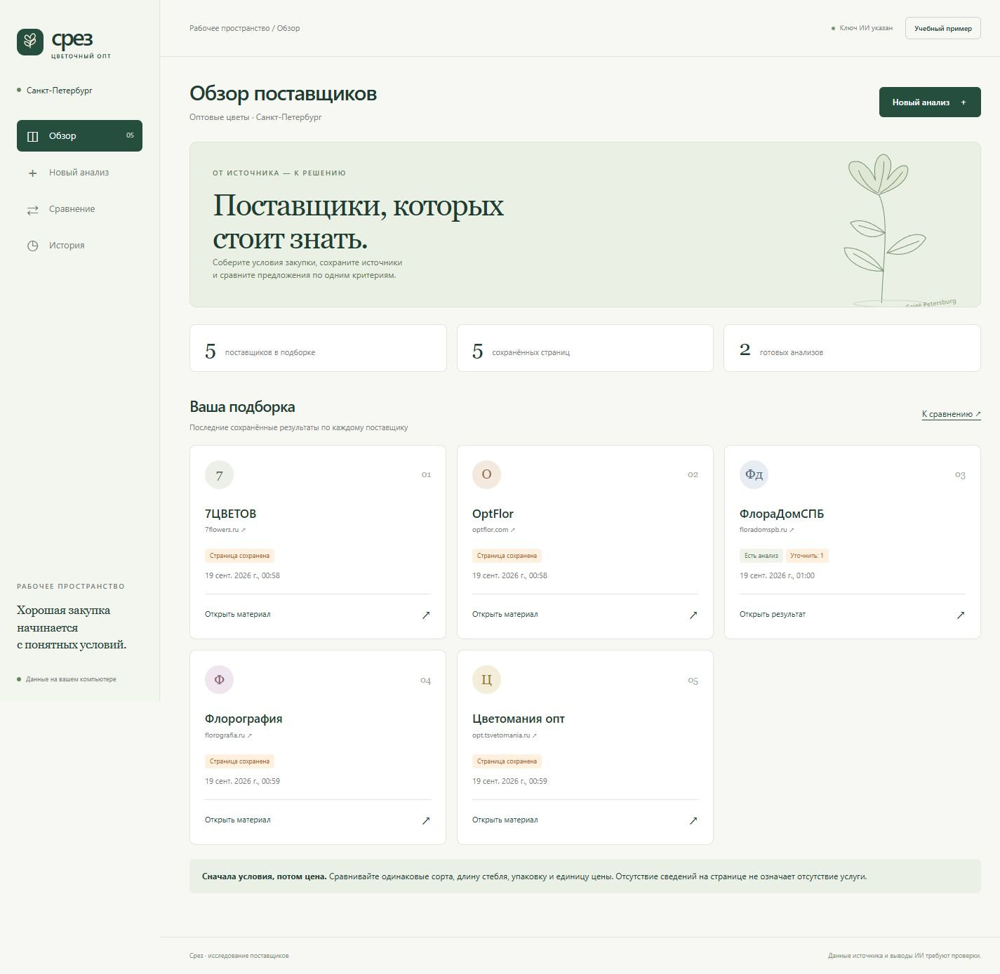
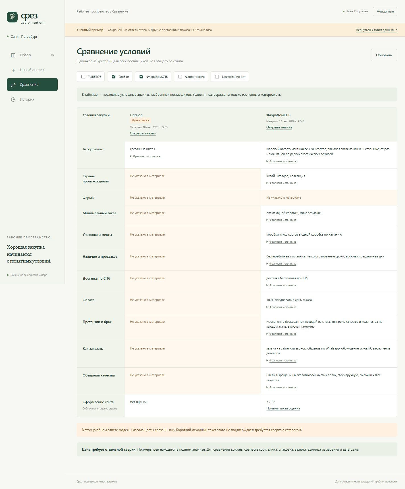

# Срез — AI-анализатор оптовых поставщиков цветов в Санкт-Петербурге

«Срез» собирает материалы поставщиков, извлекает условия закупки из текста и анализирует скриншоты. Результаты можно сравнить и открыть позже вместе с исходником.

Проект сделан в Codex для ДЗ PEm08 «Проект: мультимодальное приложение». Есть веб-интерфейс на FastAPI и настольная версия Windows на PyQt6 + Qt WebEngine. Это учебный MVP для подготовки закупки; выводы модели и актуальность цен требуют проверки.



[Инструкция](docs/INTERFACE.md) · [Windows-приложение](docs/DESKTOP.md) · [Проверки](docs/VALIDATION.md) · [Текст ДЗ](HOMEWORK.md)

## Кейс

В цветочном опте недостаточно сравнить название компании и цену. Имеют значение сорт, длина стебля, упаковка, минимальная партия, доставка по СПб, оплата и порядок претензий.

В подборке пять поставщиков:

| Поставщик | Сайт |
|---|---|
| 7ЦВЕТОВ | https://www.7flowers.ru/?geo=spb |
| OptFlor | https://www.optflor.com/ |
| ФлораДомСПБ | https://floradomspb.ru/ |
| Флорография | https://florografia.ru/ |
| Цветомания — опт | https://opt.tsvetomania.ru/ |

Материалы собирались 18–19 сентября 2026 года. В [data/](data/README.md) лежат пять примеров первых экранов с адресами, временем сбора и контрольными суммами. Полный локальный комплект этапа 2 содержит 15 текстовых страниц, 20 скриншотов, два PDF и два XLSX.

## Возможности

- Сбор страницы через Selenium: текст, первый экран, длинный снимок и метаданные.
- Анализ собственного текста или изображения PNG/JPEG/WEBP.
- Строгий JSON: ассортимент, страны, фермы, минимальный заказ, упаковка, наличие и предзаказ, доставка, оплата, претензии, способы заказа и заявления о качестве.
- Примеры цен с сортом, длиной, валютой, единицей цены и условиями. До шести примеров из одного материала; это не полный прайс.
- Оценка оформления `design_score` от 0 до 10 с объяснением.
- Цитаты из источника и мягкая оранжевая подсветка условий, которые нужно уточнить.
- Сравнение поставщиков, история, исходные файлы и сохранение результата в JSON.
- Учебный пример без новых обращений к модели или сайтам.



Сайт и настольное окно используют один интерфейс. Ключ хранится в .env, история — в SQLite и каталоге файлов. Замена .exe не удаляет данные.

## Запуск веб-версии

Нужен Python 3.12. Для нового сбора сайтов — Google Chrome.

```powershell
py -3.12 -m venv .venv
.\.venv\Scripts\python.exe -m pip --isolated install --index-url https://pypi.org/simple -r requirements.txt
Copy-Item .env.example .env
.\.venv\Scripts\python.exe run.py
```

Откройте http://127.0.0.1:8000 и нажмите «Учебный пример». Он работает без ключа. Если .env уже существует, не перезаписывайте его. Повторный запуск на подготовленном компьютере: `./start.ps1`.

Для новых анализов укажите ключ выбранного провайдера в .env. По умолчанию используются OpenAI и gpt-4.1-mini; предусмотрено переключение на ProxyAPI. Наличие ключа в интерфейсе не подтверждает доступ к модели. Реальные запросы могут расходовать баланс.

```dotenv
AI_PROVIDER=openai
OPENAI_API_KEY=
PROXY_API_KEY=
TEXT_MODEL=gpt-4.1-mini
IMAGE_MODEL=gpt-4.1-mini
```

Для ProxyAPI выберите `AI_PROVIDER=proxyapi`, заполните `PROXY_API_KEY`; модели по умолчанию — `openai/gpt-4.1-mini`. В этой работе реальные тесты выполнялись через OpenAI.

## Настольная версия Windows

На исходном компьютере: `./start-desktop.ps1`. Он открывает приложение с существующей папкой данных.

Сборка на Windows x64:

```powershell
.\.venv\Scripts\python.exe -m pip --isolated install --index-url https://pypi.org/simple -r desktop/requirements.txt
.\.venv\Scripts\python.exe build.py
```

Результат — `dist/Srez.exe` и `dist/Start-Srez.cmd`. Для запуска .exe Python отдельно не требуется. Самостоятельная копия создаёт рядом папку Srez-data. Запуск с папкой текущего проекта:

```powershell
.\dist\Srez.exe --data-dir "."
```

Пользователь подтвердил запуск настольного приложения. Автоматическая проверка Qt WebEngine из среды Codex завершалась кодом 49; этот результат сохранён отдельно и не переименован в успешный тест. [Подробнее](docs/VALIDATION.md).

## Структура

| Папка / файл | Назначение |
|---|---|
| backend/ | FastAPI, настройки, модели ответа, ИИ, Selenium и история |
| frontend/ | HTML, CSS и JavaScript без отдельной сборки |
| desktop/ | Окно PyQt6, настройки, локальный сервер, диагностика |
| data/ | Примеры исходных скриншотов и реестр источников |
| examples/stage4/ | Три сохранённых ответа для учебного режима |
| tests/ | Проверки API, истории, сравнения и desktop |
| docs/ | Инструкции, формат данных и результаты проверок |
| build.py | Сборка .exe через PyInstaller |
| runtime/ | Личные данные; исключены из Git |
| .env | Локальный ключ; исключён из Git |

## Проверка

После установки desktop/requirements.txt:

```powershell
.\.venv\Scripts\python.exe -m pytest -q
.\dist\Srez.exe --self-test ".\runtime\stage7\offline.json"
```

На подготовленной машине прошли 65 тестов и 17 автономных проверок готового .exe. При установке только веб-зависимостей проверка Qt пропускается.

Реально проверены анализ текста и изображения, сохранение истории и сбор Selenium. В учебный пример включены два текстовых анализа и один анализ изображения. Полный анализ всех пяти компаний не выполнялся: для демонстрации проекта достаточно сохранённых примеров.

## API и ограничения

Главные маршруты: `/health`, `/analyze_text`, `/analyze_image`, `/collect`, `/parsedemo`, `/history`, `/workspace`. Интерактивная документация: http://127.0.0.1:8000/docs.

Текст: 10–40 000 символов. Изображение: до 8 МБ и 25 млн пикселей. Для сайтов выбран ограниченный список поставщиков. Сервер слушает только локальный компьютер.

PDF и Excel собраны как исходные материалы, но их загрузка и анализ в приложении не реализованы. Нет автоматических заказов, проверки реального остатка и постоянного мониторинга. Приложение не выбирает «самого дешёвого» по несопоставимым ценам.

Модель может ошибаться даже при наличии цитаты. В учебном ответе OptFlor неточность явно помечена; пользователь должен сверить вывод с исходником. Подробнее: [формат анализа](docs/FORMAT.md).

## Связь с лекцией и публикация

Ссылка на репозиторий преподавателя в переданном cursor_.md отсутствовала. Проект восстановлен по описанной структуре; клонирование исходного репозитория не заявляется. Вместо animation_potential добавлены поля закупки цветов, а design_score сохранён для визуального анализа.

В подготовленный комплект входят исходники, инструкции, скриншоты и сохранённые примеры. Ключ, runtime, окружение Python и .exe не входят в Git. [Публикация на GitHub](docs/GITHUB.md).
